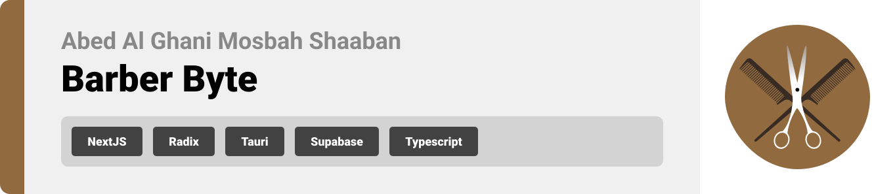

<br><br>

<!-- project philosophy -->


> A website for men and women to discover the best barber shops and reserve an appointment
> easily for their haircut.
>
> Barber Byte also enables barbershop owners to manage their business on the desktop
> application. It helps them view their shop's data and clients' activity to help them
> predict their next move.

# User Stories

### client Users:

- As a client, I want to easily find nearby and high-quality barber shops.
- As a client, I'm seeking the latest trends for hairstyling and haircut suggestions.
- As a client, I prefer booking appointments online at barber shops to avoid long waits
  among a crowd of clients.

### Manager Users:

- As the manager, I aim to showcase my barber shop's location, ensuring clients easily
  find us.
- As a manager, I strive to establish an online presence and grow a dedicated fan base.
- As a manager, my goal is to efficiently handle client management through online
  platforms.

### Admin Users:

- As an admin, I need to monitor the project's performance closely to ensure its success.
- As an admin, I track user activity for effective management to allow me to address user
  needs and enhance overall performance.
- As an admin, I want to analyze data to make informed decisions and optimize project
  outcomes.

<br><br>

<!-- Tech stack -->


### Barber Byte is built using the following technologies:

- This project uses [Turbo Repo](https://turbo.build/repo). Turborepo is a
  high-performance build system for JavaScript and TypeScript codebases.
- For the frontend, the web app uses the [Next.JS app router](https://nextjs.org/).
  Next.js is a React framework that supports server-side rendering.
- For the backend, [Laravel API](https://laravel.com/) is used. Leveraging the MVC model,
  Laravel ensures app security through well-structured routes, middleware, and
  authentication mechanisms.
- The foundation of this project is built upon [Tauri](https://tauri.app/), a framework
  for creating desktop applications. Building an optimized, secure, and
  frontend-independent application for multi-platform deployment.
- The app uses [OpenAI API](https://openai.com/) as an endpoint to request AI image
  generated haircuts with [DALL·E](https://platform.openai.com/docs/models/dall-e) as
  recommended haircuts and showcase for clients.

<br><br>

<!-- UI UX -->


> Barber Byte's design journey involved crafting wireframes and mockups. Through iterative
> design processes, we refined the layout to achieve an optimal structure, ensuring easy
> navigation and a seamless user experience.

- Project Figma design
  [figma](https://www.figma.com/file/Y15px4lYuSGMpmcux5A4VM/Final-Project?type=design&node-id=4%3A20&mode=design&t=XOBtYuopoTlFSXEw-1)

### Mockups

| Home screen                     | Feed Screen                     | Order Screen                             |
| ------------------------------- | ------------------------------- | ---------------------------------------- |
| 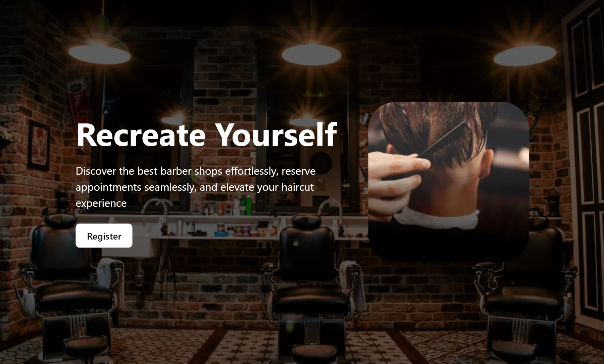 | 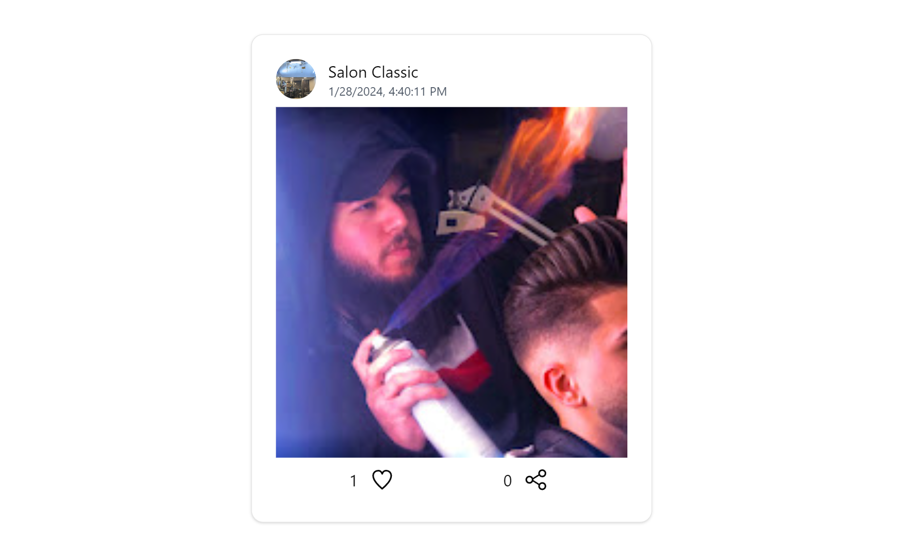 | 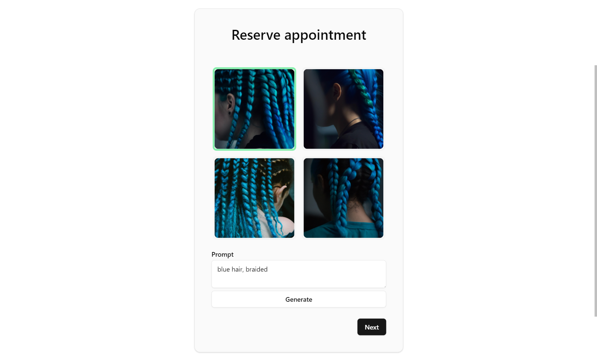 |

<br><br>

<!-- Database Design -->


### Architecting Data Excellence: Innovative Database Design Strategies:

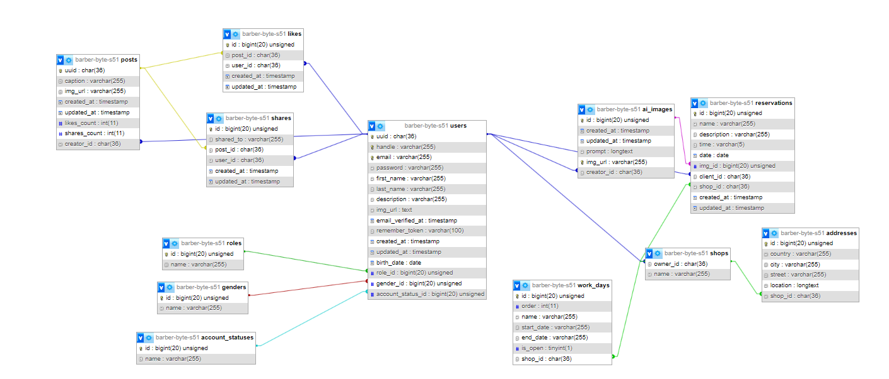

<br><br>

<!-- Implementation -->


### User Screens (Mobile)

| Login screen                                           | Register screen                                    | Landing screen                                     | Loading screen                                   |
| ------------------------------------------------------ | -------------------------------------------------- | -------------------------------------------------- | ------------------------------------------------ |
| 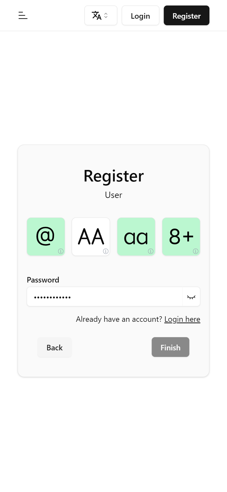       | 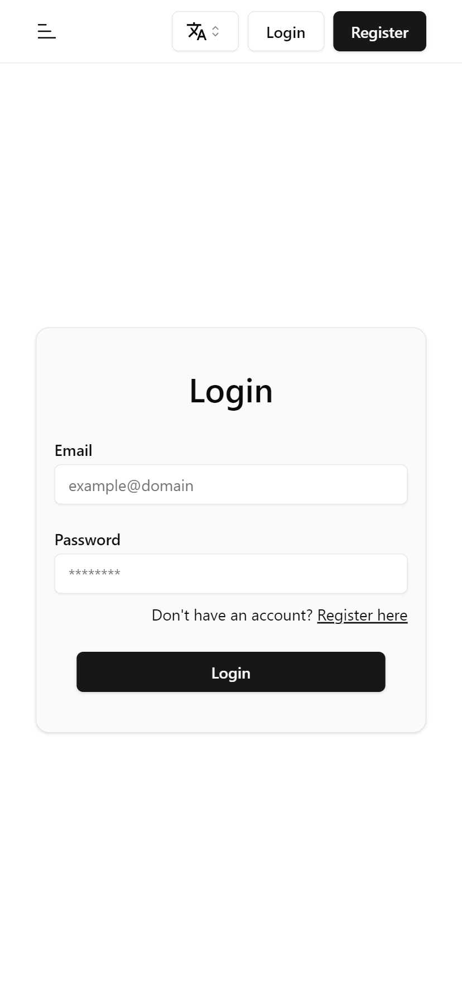                  |              | 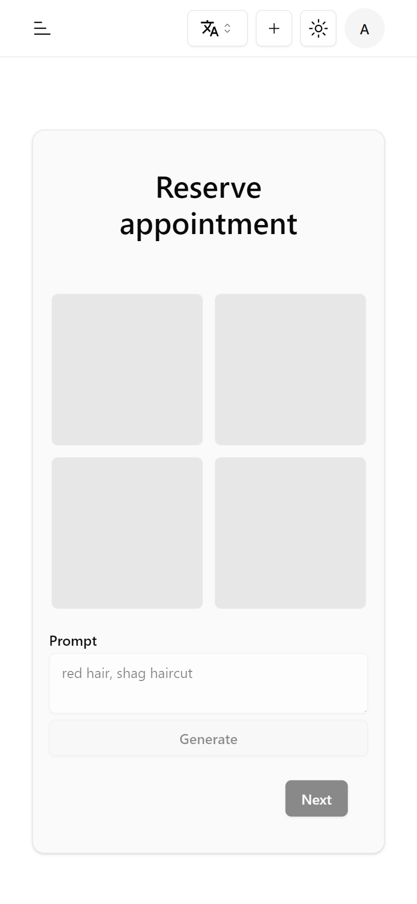  |
| Generate Image screen                                  | Choose Shop screen                                 | Select Time screen                                 | Checkout Screen                                  |
| 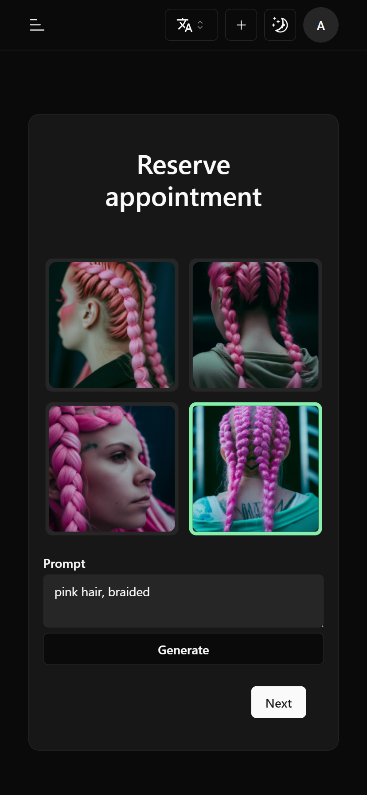 | 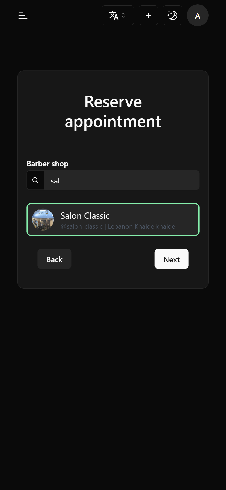 | 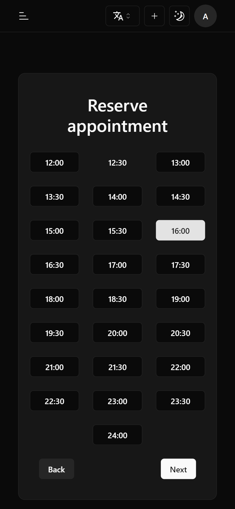 | 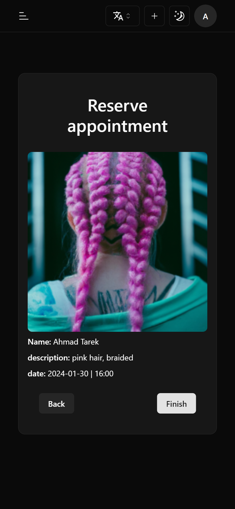 |
| Generate Image screen                                  | Edit Profile screen                                |
| 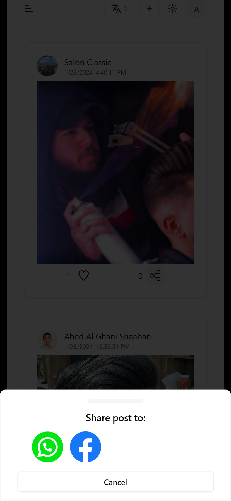                      | 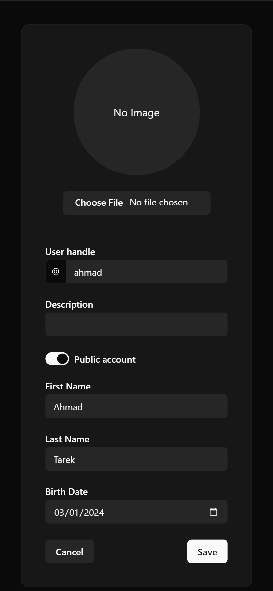               |

### Admin Screens (Web)

| Login screen                                                        | Home screen                                 | Reservations screen                                      |
| ------------------------------------------------------------------- | ------------------------------------------- | -------------------------------------------------------- |
| 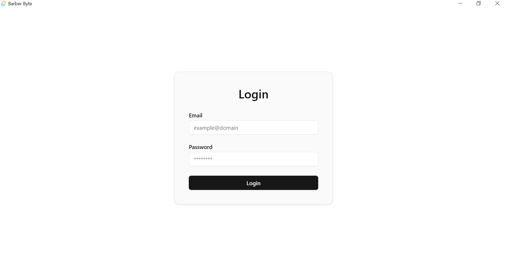                       | 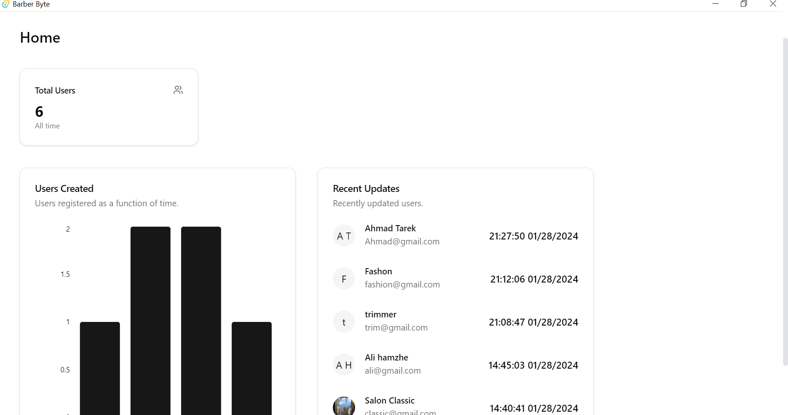   | 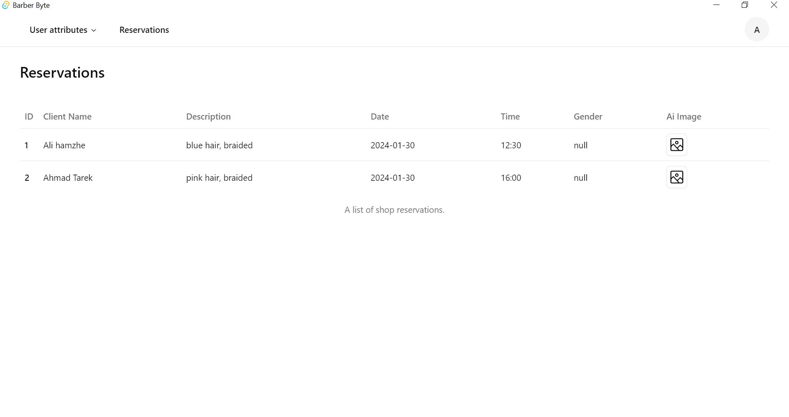 |
| Reservation Image screen                                            | Users Analytics Screen                      |
|  | 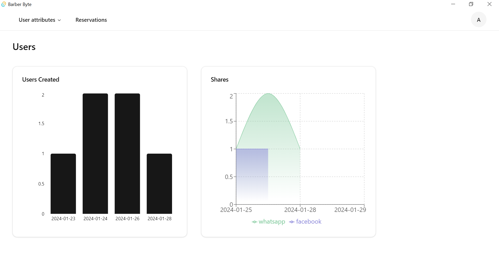 |

<br><br>

<!-- Prompt Engineering -->


### Mastering AI Interaction: Unveiling the Power of Prompt Engineering:

- In this project, we leverage advanced prompt engineering techniques to enhance the
  interaction with natural language processing models. We carefully tell these models what
  to do by giving them specific instructions. The snippet below is an example of how we do
  it. By doing this, we make sure these models understand and create exactly what we want,
  making the whole process work smoothly and accurately for different tasks and
  preferences.

```php
$prompt = "film still, portrait of a human, " . $request->prompt . ", salon photography";
```

This piece of code is a small example of how we make sure the computer models create
images exactly as we want them to, tailored to specific instructions and user needs.

<br><br>

<!-- AWS Deployment -->


### Efficient AI Deployment: Unleashing the Potential with AWS Integration:

- This project leverages AWS deployment strategies to seamlessly integrate and deploy
  natural language processing models. With a focus on scalability, reliability, and
  performance, we ensure that AI applications powered by these models deliver robust and
  responsive solutions for diverse use cases.

  By following these steps, we deployed the backend to Amazon Linux 2023.

  1. Update Amazon Linux 2023 Packages
  2. Install LAMP Stack
  3. Start and enable the Apache and MariaDB services
  4. Create Database
  5. Install PHP Composer for Laravel on on.Linux 2023
  6. Download the Laravel framework project
  7. Install Laravel on Amazon Linux 2023
  8. Create the Laravel environment configuration file
  9. Apache Configuration for PHP Laravel App
  10. Get the Laravel demo page

<br><br>

<!-- Unit Testing -->


### Precision in Development: Harnessing the Power of Unit Testing:

- This project employs rigorous unit testing methodologies to ensure the reliability and
  accuracy of code components. By systematically evaluating individual units of the
  software, we guarantee a robust foundation, identifying and addressing potential issues
  early in the development process.

<br><br>

<!-- How to run -->


> To set up Barber Byte locally, follow these steps:

### Prerequisites

This is an example of how to list things you need to use the software and how to install
them.

- pnpm
  ```sh
  npm install -g pnpm
  ```

### Installation

1. Get an API Key at [OpenAI](https://openai.com/)
2. Clone the repo

   ```sh
   git clone https://github.com/abedshaaban/barber-byte.git

   ```

3. Install PNPM packages

   ```sh
   pnpm install
   ```

4. Setup the backend

   - Change directory to the backend folder
     ```sh
     cd apps/backend
     ```
   - Install the required packages for Laravel
     ```sh
     composer install
     ```
   - Add Laravel environment variable for JWT via
     ```sh
     php artisan jwt:secret
     ```
     Enter the required environment variables in `/apps/backend.env`
   - Migrate the database (make sure xamp is runing)
     ```sh
     php artisan migarte
     ```
   - Run the server
     ```sh
     php artisan serve
     ```

   Now the server is running

5. Setup the frontend

   Enter the required environment variables in `.env` (root folder)

   - Run the app

   ```sh
   pnpm dev --filter=web
   ```

   Now the web app is running

Now, you should be able to run Barber Byte locally and explore its features.
