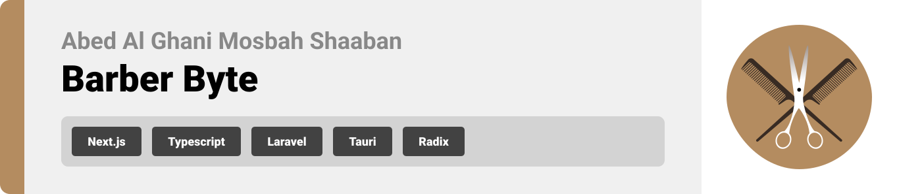
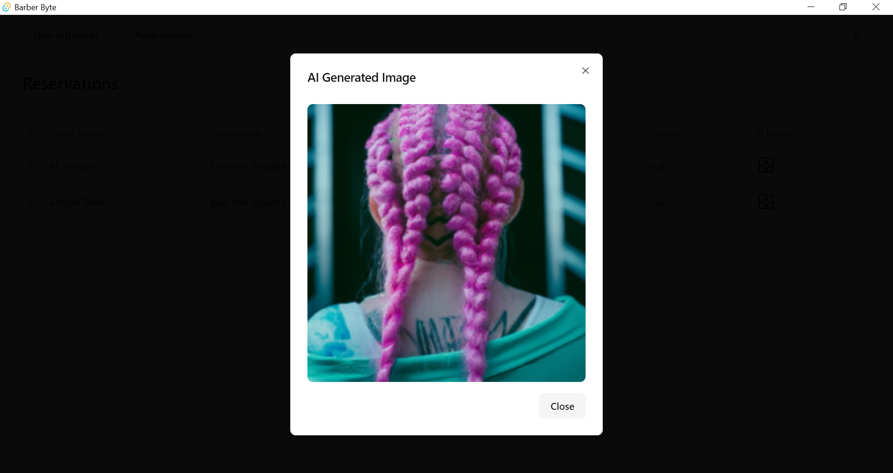
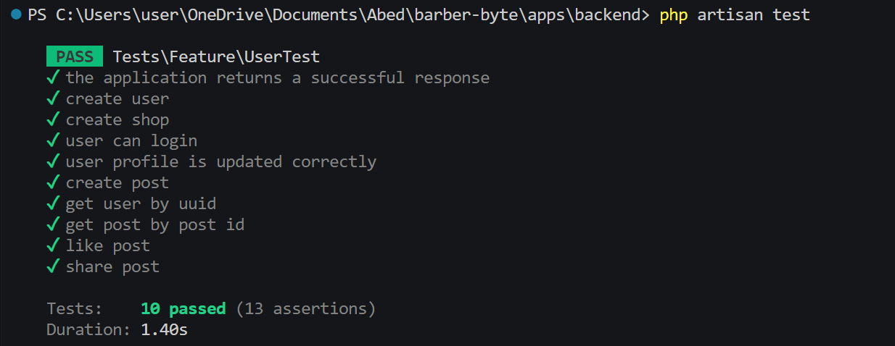

<br><br>

<!-- project philosophy -->


> A website for men and women to discover the best barber shops and reserve an appointment
> easily for their haircut.
>
> Barber Byte also enables barbershop owners to manage their business on the desktop
> application. It helps them view their shop's data and clients' activity to help them
> predict their next move.

# User Stories

### Client Users:

- As a client, I want to easily find nearby and high-quality barber shops and book
  appointments online to avoid long waits among a crowd of clients.
- As a client, I'm seeking the latest trends for hairstyling and haircut suggestions.

### Admin Users:

- As an admin, I need to monitor the project's performance closely to ensure its success
  and track user activity for effective management, allowing me to address user needs and
  enhance overall performance.
- As an admin, I want to analyze data to make informed decisions and optimize project
  outcomes.

<br><br>

<!-- Tech stack -->


### Barber Byte is built using the following technologies:

- This project uses [Turbo Repo](https://turbo.build/repo). Turborepo is a
  high-performance build system for JavaScript and TypeScript codebases.
- For the frontend, the web app uses the [Next.JS app router](https://nextjs.org/).
  Next.js is a React framework that supports server-side rendering.
- For the backend, [Laravel](https://laravel.com/) is used. Leveraging the MVC model,
  Laravel ensures app security through well-structured routes, middleware, and
  authentication mechanisms.
- The foundation of this project is built upon [Tauri](https://tauri.app/), a framework
  for creating desktop applications. Building an optimized, secure, and
  frontend-independent application for multi-platform deployment.
- The app uses [OpenAI API](https://openai.com/) as an endpoint to request AI
  image-generated haircuts with [DALL·E](https://platform.openai.com/docs/models/dall-e)
  as recommended haircuts and showcases for clients.

<br><br>

<!-- UI UX -->


> Barber Byte's design journey involved crafting wireframes and mockups. Through iterative
> design processes, we refined the layout to achieve an optimal structure, ensuring easy
> navigation and a seamless user experience.

### Mockups Examples

Check the project's wireframes and mockups on
[figma](https://www.figma.com/file/Y15px4lYuSGMpmcux5A4VM/Final-Project?type=design&node-id=4%3A20&mode=design&t=XOBtYuopoTlFSXEw-1)

<div align="center">

|                                  Home screen                                  |                                     Order Screen                                      |                                     Feed screen                                     |
| :---------------------------------------------------------------------------: | :-----------------------------------------------------------------------------------: | :---------------------------------------------------------------------------------: |
|  |  |  |

</div>

<br><br>

<!-- Database Design -->


The database is designed to facilitate the collection and management of user data within a
comprehensive platform. Each table plays a crucial role in capturing various aspects of
user interactions, preferences, and engagements.


<br><br>

<!-- Implementation -->


### User Screens (Mobile)

| Register screen                                                                           | Login screen                                                                               | Landing screen                                                                             | Loading screen                                                                                    |
| ----------------------------------------------------------------------------------------- | ------------------------------------------------------------------------------------------ | ------------------------------------------------------------------------------------------ | ------------------------------------------------------------------------------------------------- |
|            |                   |              |          |
| Generate Image screen                                                                     | Choose Shop screen                                                                         | Select Time screen                                                                         | Checkout Screen                                                                                   |
|  |  |  |           |
| Generate Image screen                                                                     | Edit Profile screen                                                                        | Create Post screen                                                                         | User Reservations screen                                                                          |
|             |        |       |  |

### Admin Screens (Web)

| Home screen                                                         | Reservations screen                                      |
| ------------------------------------------------------------------- | -------------------------------------------------------- |
|                            |  |
| Reservation Image screen                                            | Users Analytics Screen                                   |
|  |               |

<br><br>

<!-- Prompt Engineering -->


In this project, we support advanced prompt engineering techniques to enhance the
interaction with natural language processing models. We carefully tell these models what
to do by giving them specific instructions. The snippet below is an example of how we do
it. By doing this, we ensure these models understand and create exactly what we want,
making the whole process work smoothly and accurately for different tasks and preferences.

```php
public function generate_image(Request $request){
  $request->validate([
    'prompt' => 'required|string',
    'size' => 'required|string',
    'n' => 'required|integer',
  ]);

  // create the prompt
  $prompt = "film still, portrait of a human, " . $request->prompt . ", salon photography";


  try{
    // generate the images with openai
    $result = OpenAI::images()->create([
      'model' => 'dall-e-2',
      'prompt' => $prompt,
      'size' => $request->size,
      'style' => "vivid",
      'n' => intval($request->n),
      'user' => $this->user->uuid,
    ]);

    // check if the images are generated
    if(count($result->data) > 0){
      // make a folder for the images if their is not one
      $folder_path = 'images/ai-haircut/';
      if (!file_exists(public_path($folder_path))) {
        mkdir(public_path($folder_path), 0755, true);
      }

      $res = [];

      // insert the images in the ai_images table
      foreach ($result->data as $imageData) {
        $image_url = time() . rand(3, 9000000000) . '.' . 'png';
        file_put_contents(public_path($folder_path . $image_url), file_get_contents($imageData->url));

        $image_id = AiImage::create([
          'prompt' => $prompt,
          'creator_id' => $this->user->uuid,
          'img_url' => $image_url,
        ])->id;

        // add images to the response
        $res[] = [
          'url' => $image_url,
          'id' => $image_id,
        ];
      }

      return response()->json([
        'status' => true,
        'message' => 'Image generated successfully',
        'data' => $res,
        'error' => ''
      ], 200);
    } else {
      // handle error of zero images
      return response()->json([
        'status' => false,
        'message' => 'Image not generated',
        'data' => '',
        'error' => 'zero images returned after generating'
      ], 500);
    }
  } catch (\Exception $exception){
    // catch any error while generating images
    return response()->json([
      'status' => false,
      'message' => 'Error occurred while generating image.',
      'data' => '',
      'error' => $exception->getMessage()
    ], 500);
  }
}
```

This piece of code is a small example of how we make sure the computer models create
images exactly as we want them to, tailored to specific instructions and user needs.

<br><br>

<!-- AWS Deployment -->


This project leverages AWS deployment strategies to seamlessly integrate and deploy
natural language processing models. With a focus on scalability, reliability, and
performance, we ensure that AI applications powered by these models deliver robust and
responsive solutions for diverse use cases.

By following these steps, we deployed the backend to Amazon Linux 2023.

1. Update Amazon Linux 2023 Packages
2. Install LAMP Stack
3. Start and enable the Apache and MariaDB services
4. Create Database
5. Install PHP Composer for Laravel on Linux 2023
6. Download the Laravel framework project
7. Install Laravel on Amazon Linux 2023
8. Create the Laravel environment configuration file
9. Apache Configuration for PHP Laravel App
10. Get the Laravel demo page

> Commands are available in the [backend folder](./apps/backend/deploy-to-aws.md)

<br><br>

<!-- Unit Testing -->


Barber Byte uses testing to make sure each piece of code works reliably and accurately. By
checking individual units of the software systematically, we ensure a strong foundation.
This helps us find and fix potential issues early in the development process.



These tests check different parts of the application, like user registration, shop
creation, login, profile updates, post creation, and more. Each test makes sure a specific
part of the system works correctly, making the overall software strong and dependable.

<br><br>

<!-- How to run -->


> To set up Barber Byte locally, follow these steps:

### Prerequisites

This is an example of how to list things you need to use the software and how to install
them.

- pnpm
  ```sh
  npm install -g pnpm
  ```

### Installation

1. Get an API Key at [OpenAI](https://openai.com/)
2. Clone the repo

   ```sh
   git clone https://github.com/abedshaaban/barber-byte.git

   ```

3. Install PNPM packages

   ```sh
   pnpm install
   ```

4. Setup the backend

   - Change the directory to the backend folder
     ```sh
     cd apps/backend
     ```
   - Install the required packages for Laravel
     ```sh
     composer install
     ```
   - Add Laravel environment variable for JWT via
     ```sh
     php artisan jwt:secret
     ```
     Enter the required environment variables in `/apps/backend.env`
   - Migrate the database (make sure xamp is running)
     ```sh
     php artisan migrate
     ```
   - Run the server
     ```sh
     php artisan serve
     ```

   Now the server is running

5. Setup the frontend

   Enter the required environment variables in `.env` (root folder)

   - Run the app

   ```sh
   pnpm dev --filter=web
   ```

   Now the web app is running

Now, you should be able to run Barber Byte locally and explore its features.
