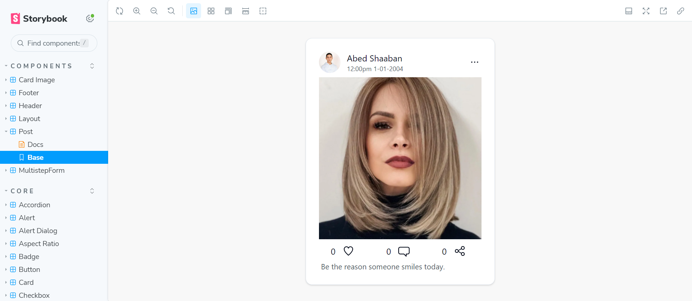
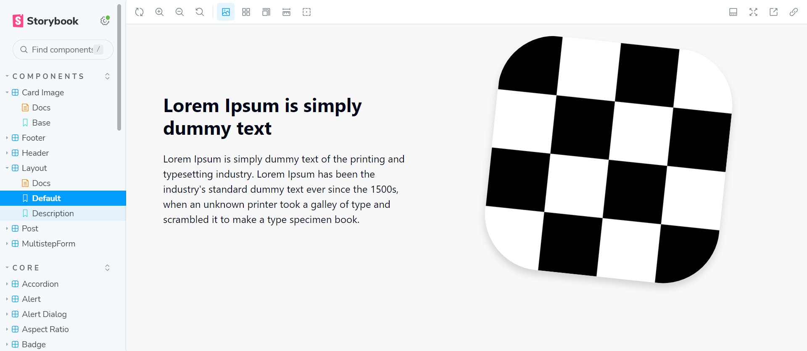
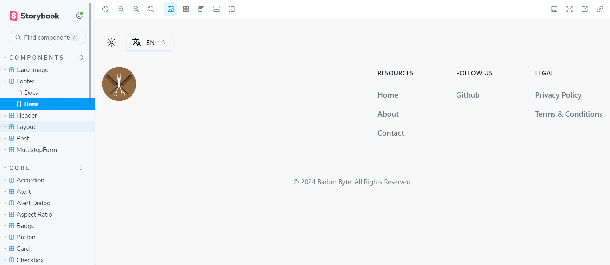

    

All Barber Byte's UI can be view in the through [Storybook](https://storybook.js.org/). To
strat Storybook just run `pnpm storybook` in the ui package directory. Storybook preview
and ui can be view down below.

## UI

### Post

    

### Layout

    

### Footer

    

